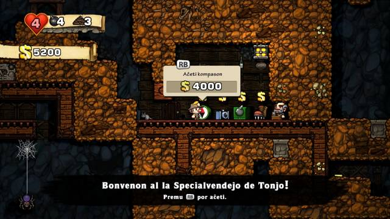
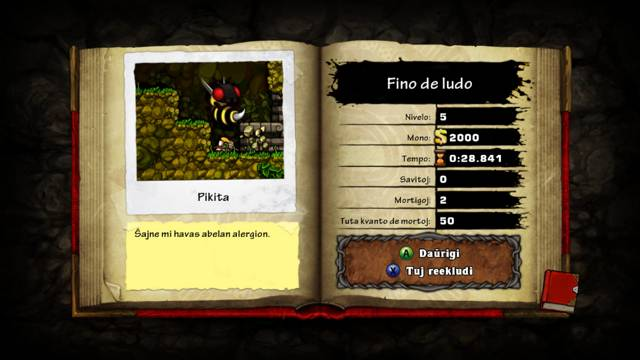
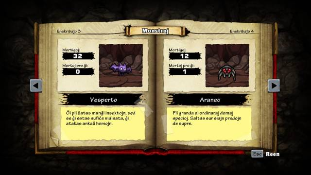
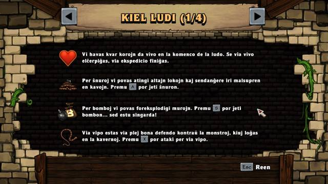

[*(click here to read this page in English)*](README-en.md)

# Spelunky en Esperanto

Jen modifaĵo, kiu ebligas ludi Spelunky en Esperanto. (Pli precize temas pri Spelunky HD por Windows.) Ĝi aldonas ĉapelitajn literojn, kaj anstataŭigas ĉiujn anglajn tekstojn per tekstoj en Esperanto.

Ĉi tio estas ankoraŭ beta-versio de mia traduko. Certe estas ankoraŭ kelkaj eraroj en ĝi. Se vi havas korektojn aŭ proponojn por plibonigoj en la traduko, vi povas kontakti min en Telegram per @Spenchjo, aŭ retpoŝte per spenchjo&nbsp;[ĉe]&nbsp;gmail.com

Por provlegantoj, utilus la [provlega listo](https://github.com/Rajzin/Spelunky-Esperanto-traduko/blob/master/provlega%20listo.txt), kiu listigas ĉiujn tradukaĵojn en la angla kaj Esperanto. Vidu ankaŭ miajn [tradukajn notojn](https://github.com/Rajzin/Spelunky-Esperanto-traduko/blob/master/tradukaj%20notoj.txt) por klarigoj pri miaj elektoj en la traduko.

## Kiel instali

Estas tri manieroj por instali la modifaĵon:

1. [Simpla instalo](kiel-instali/per-simpla-instalado.md) - la plej rapida kaj facila maniero por instali.
2. [Instalo per Patchlunky](kiel-instali/per-patchlunky.md) - la plej sekura maniero por instali. Estos malpli da ŝanco, ke vi akcidente fuŝos ion en la dosieroj de la ludo. Ĉi tiu metodo ankaŭ facile ebligas kombini ĉi tiun modifaĵon kun aliaj modifaĵoj.
3. [Permana instalo per Spelunktool](kiel-instali/per-spelunktool.md) - la plej nerda maniero por instali. Ĉi tiel vi havos plej da regpovo.

Klaku ligilon por pli da klarigoj.

## Kiel ekhavi la ludon

Antaŭ instali la Esperanto-tradukon, necesas aĉeti la ludon. Oni povas aĉeti la ludon [ĉi tie](https://store.steampowered.com/app/239350/Spelunky/) ĉe Steam, aŭ [ĉi tie](https://www.gog.com/game/spelunky) ĉe GOG.

La Steam-versio havas iomete pli da funkcioj, kiuj utiligas interretan konekton. Ekzemple ĉiutagaj defioj, atingaĵoj (achievements), kaj rangotabuloj por kompari siajn poentrekordojn kun amikoj aŭ aliaj ludantoj tutmonde. Aĉetu la GOG-version, se vi volas subteni la sen-[DRM](https://eo.wikipedia.org/wiki/Digital_rights_management)-an movadon. (Tamen, ankaŭ la Steam-versio de Spelunky estas sen DRM!)
