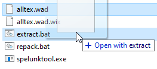
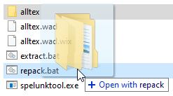

# How to install the Esperanto translation in Spelunky
## with Spelunktool

[*(klaku ĉi tie por klarigoj en Esperanto)*](per-spelunktool.md)

Spelunktool is a tool for manually editing the game files. This method is for people with a little bit more technical knowledge.

### Preparatoin:

Download Spelunktool [here](http://www.tzarsectus.com/tools/spelunktool.rar), and unpack it where you want.

Go to [the download page of the Esperanto translation](https://github.com/Rajzin/Spelunky-Esperanto-traduko/releases/) and download the latest version of the plm file with "por patchlunky" in the name. When you've downloaded it, change the file extenstion from .plm to .zip. This file contains the modded files you need to install the Esperanto translation.

Go to the folder where you installed Spelunky, and make backups of the unmodded files in the folders ...\Spelunky\Data\Textures and ...\Spelunky\Data\Localization (and any other files you intend to change). With these backups you can easily repair the game if you mess something up, or undo your changes if you want to revert back to the unmodded game.

### How to use Spelunktool:

Go to where you installed Spelunky, and go to ...\Spelunky\Data\Textures. Copy the files "alltex.wad" (which is a compliation of all texture files in Spelunky) and "alltex.wad.wix" (which is like a table of contents of alltex.wad), and paste them in the Spelunktool folder. You need both files!

In the Spelunktool folder, drag alltex.wad onto extract.bat. Spelunktool will export all the contents of alltex.wad to a new folder "alltex". You can change the contents of this folder however you want.

After you're done editing the files, go back to the Spelunktool folder and drag the folder "alltex" onto "repack.bat". Spelunktool will repack the files and replace "alltex.wad" and "alltex.wad.wix" with new versions with the changes you made. Put "alltex.wad" and "alltex.wad.wix" back in ...\Spelunky\Data\Textures to apply your changes.

(You can also mod other .wad files in the same way, if you want.)

### How to install the translation:

- **To replace the English texts with Esperanto**, take "strings.pct" from the folder "Localization" in the plm file, and place it in ...\Spelunky\Data\Localization.

> If you prefer keeping the option to choose the English version in the game options, you can also replace another language with Esperanto. To do so, rename the modded "strings.pct" to match the name of another language file (e.g. "french.pct") before placing it in ...\Spelunky\Data\Localization

- **To install Esperanto letters**, there are two things you have to do:
  - Take the font textures from the folder "Textures\alltex\FONTS" in the plm file, and place them in the folder "FONTS" inside of alltex.wad using Spelunktool.
  - Take the modded font files in "Textures" in the plm file, and place them in the folder ...\Spelunky\Data\Textures, next to alltex.wad.

- (optional) **To get an Esperanto flag for the language selector** in the game options, take "hudelements.png" from the folder "Textures\alltex\ATSTART" in the plm file, and place it in the folder "ATSTART" inside of alltex.wad using Spelunktool.

> If you chose another language than English to replace with Esperanto, you need to use another file. Go to "alternativaj teksturoj" in the plm file, choose the right file (for example, if you replaced French with Esperanto, choose "hudelements FR-al-EO.png"), rename it to "hudelements.png", and use that instead of the other hudelements.png.
