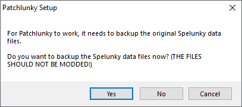

# Kiel instali Esperanton en Spelunky
## per la programo Patchlunky

[*(click here for a guide in English)*](howtoinstall-patchlunky.md)

Patchlunky estas programo, per kiu oni povas instali kaj mastrumi diversajn modifaĵojn en Spelunky. Ĝi aŭtomate faras savkopion de la nemodifitaj dosieroj por vi, kaj facilas rapide instali kaj malinstali modifaĵojn per ĝi.

### Resuma klarigo

Iru al [la elŝutpaĝo de Patchlunky](https://github.com/Worst-vd-plas/Patchlunky/releases) kaj elŝutu la plej novan version. Malpaku la zip-dosieron tien, kien vi volas instali Patchlunky.

Iru al [la elŝutpaĝo de la Esperanto-traduko](https://github.com/Rajzin/Spelunky-Esperanto-traduko/releases/) kaj elŝutu la plej novan plm-dosieron "por patchlunky". Prenu la plm-dosieron, iru al la loko kien vi malpakis Patchlunky, kaj metu la plm-dosieron en la dosierujon "Mods".

Malfermu Patchlunky.exe, kaj agordu ĝin normale.

#### Por instali la Esperanto-tradukon
En Patchlunky, elektu "Esperanto traduko" en la listo (kaj ĉiun alian modifaĵon, kiun vi volas instali), kaj premu la butonon "Patch Game".

#### Por malinstali la Esperanto-tradukon
En Patchlunky, iru al la langeto "Settings" kaj premu la butonon "Restore default game files".

### Detala klarigo

1. Certigu, ke vi instalis Spelunky, per Steam aŭ GOG. (Sen aliaj instalitaj modifaĵoj!)
2. Iru al [la elŝutpaĝo de Patchlunky](https://github.com/Worst-vd-plas/Patchlunky/releases) kaj elŝutu la plej novan version.
3. Malpaku la elŝutitan zip-dosieron tien, kien vi volas instali Patchlunky.

4. Iru al [la elŝutpaĝo de la Esperanto-traduko](https://github.com/Rajzin/Spelunky-Esperanto-traduko/releases/) kaj elŝutu la plej novan plm-dosieron "por patchlunky".
5. Prenu la plm-dosieron, iru al la loko kien vi malpakis Patchlunky, kaj metu la plm-dosieron en la dosierujon "Mods".

6. En la dosierujo "Patchlunky", malfermu "Patchlunky.exe".

7. Patchlunky devas scii, kie en via komputilo la ludo Patchlunky estas instalita. Se vi klakas al "Yes", la programo verŝajne aŭtomate trovos la ĝustan lokon por vi. Se vi klakas al "No", la programo demandos, ĉu vi volas mane indiki la lokon de la Spelunky-dosierujo.

8. Por funkcii bone, Patchlunky devas fari savkopiojn de la nemodifitaj dosieroj de Spelunky. Klaku al "Yes" se vi volas tuj fari savkopiojn. Klaku al "No" se vi volas fari tion poste (ĉe Settings -> Setup Patchlunky). Se vi lasis ĝin fari savkopiojn, Patchlunky estas nun tute instalita kaj preta por instali la tradukon.

9. Por instali la tradukon, marku la skatoleton apud "Esperanto traduko", kaj premu la butonon "Patch Game". (La ludo devas NE esti malferma kiam vi klakas la butonon!)
10. Preta!

Malfermu Spelunky (per la butono "Launch Game", aŭ tiel kiel vi normale malfermas la ludon), kaj ĝi funkcios.

Se antaŭ instali la modifaĵon vi ludis Spelunky en alia lingvo ol la angla, vi devas iri al la agordoj kaj tie ŝanĝi la lingvon al Esperanto.

### Kiel ĝisdatigi

Se aperos nova versio de la traduko, sed vi jam instalis la modifaĵon per Patchlunky, jen kiel ĝisdatigi vian ludon:
1. Iru al [la elŝutpaĝo de la Esperanto-traduko](https://github.com/Rajzin/Spelunky-Esperanto-traduko/releases/) kaj elŝutu la plej novan plm-dosieron "por patchlunky".
2. Iru al la dosierujo de Patchlunky, forigu la malnovan plm-dosieron en la dosierujo "Mods", kaj metu la novan plm-dosieron anstataŭ ĝi.
3. Malfermu Patchlunky
4. Marku la skatoleton apud "Esperanto traduko", kaj premu la butonon "Patch Game". (La ludo devas NE esti malferma kiam vi klakas la butonon!)
5. Preta!