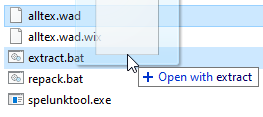
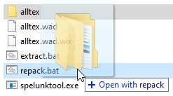

# Kiel instali Esperanton en Spelunky
## per la modifilo Spelunktool

Spelunktool estas ilo, kiu ebligas mane redakti la dosierojn de la ludo. Ĉi tiu instalmaniero estas por iom pli teĥnike spertaj homoj.

### Preparado:

Elŝutu Spelunktool de [ĉi tie](http://www.tzarsectus.com/tools/spelunktool.rar), kaj malpaku ĝin kien vi volas.

Iru al [la elŝutpaĝo de la Esperanto-traduko](https://github.com/Rajzin/Spelunky-Esperanto-traduko/releases/) kaj elŝutu la plej novan zip-dosieron "por patchlunky kaj spelunktool". Ĝi enhavas la modifitajn dosierojn, kiujn vi bezonas por instali la Esperanto-tradukon.

Iru al la loko, kie vi instalis Spelunky, kaj faru savkopiojn de nemodifitaj dosieroj en la dosierujoj ...\Spelunky\Data\Textures kaj ...\Spelunky\Data\Localization (kaj ĉiuj aliaj dosieroj, kiujn vi planas modifi). Per tio vi povos facile ripari la ludon se vi fuŝos ion, kaj vi povos poste malfari viajn ŝanĝojn se vi volos.

### Kiel uzi Spelunktool:

Iru al la loko, kie vi instalis Spelunky, kaj iru al ...\Spelunky\Data\Textures. Kopiu la dosierojn "alltex.wad" (kiu estas ariga dosiero de ĉiuj teksturdosieroj en Spelunky) kaj "alltex.wad.wix" (kiu estas kvazaŭ enhavtabelo de alltex.wad), kaj gluu ilin en la dosierujon de Spelunktool. Necesas havi ambaŭ!

En la Spelunktool-dosierujo, prenu alltex.wad kaj ŝovu ĝin sur la dosieron extract.bat. Spelunktool eksportos la tutan enhavon de alltex.wad al nova dosierujo "alltex". Vi povas ŝanĝi la enhavon de tiu dosierujo laŭ via plaĉo.

Kiam vi finis redakti la enhavon, iru denove al la dosierujo de Spelunktool kaj ŝovu la dosierujon "alltex" sur la dosieron "repack.bat". Tiam Spelunktool repakas la novan enhavon kaj anstataŭas "alltex.wad" kaj "alltex.wad.wix" laŭ la nova enhavo. Denove remetu "alltex.wad" kaj "alltex.wad.wix" en la lokon ...\Spelunky\Data\Textures por efektivigi viajn ŝanĝojn.

(Vi povas modifi aliajn .wad-dosierojn laŭ la sama maniero, se vi volas.)

### Kiel instali la tradukon:

- **Por anstataŭi la anglajn tekstojn per Esperanto**, prenu "strings.pct" el la dosierujo "Localization" en la traduka zip-dosiero, kaj metu ĝin en ...\Spelunky\Data\Localization.

> Se vi preferas reteni la eblon elekti la anglan tradukon en la agordoj de la ludo, vi povas anstataŭi alian lingvon per la Esperanto-traduko. Por fari tion, alinomigu la modifitan "strings.pct" por kongrui kun la nomo de alilingva dosiero (ekz. "french.pct") antaŭ meti ĝin en ...\Spelunky\Data\Localization

- **Por instali ĉapelliterojn**, estas du aferoj por fari:
  - Prenu la tiparajn teksturojn el la dosierujo "Textures\alltex\FONTS" en la traduka zip-dosiero, kaj metu ilin en la dosierujon "FONTS" en alltex.wad per Spelunktool.
  - Prenu la modifitajn tipardosierojn de "Textures" en la traduka zip-dosiero, kaj metu ilin en la dosierujon ...\Spelunky\Data\Textures, apud alltex.wad.

- **Por meti Esperantoflagon ĉe la lingvoelektilo** en la agordoj de la ludo, prenu "hudelements.png" el la dosierujo "Textures\alltex\ATSTART" en la traduka zip-dosiero, kaj metu ilin en la dosierujon "ATSTART" en alltex.wad per Spelunktool.

> Se vi anstataŭis alian lingvon ol la angla per la Esperanto-traduko, vi uzu alian dosieron. Iru al "alternativaj teksturoj" en la traduka zip-dosiero, elektu la ĝustan dosieron (ekzemple, se vi anstataŭis la francan per Esperanto, elektu "hudelements FR-al-EO.png"), alinomu ĝin al "hudelements.png", kaj uzu tion en la ĉi-supra paŝo.
